**Text Analytics in DotA 2: 
Predicting Victory From Cross-Team Chat**

Sriganesh Gopal, Rees Braam, Jared Robertson, Wayne Ji

Anonymized usage is permitted.

**Abstract**

DotA 2 is an online MOBA video game that pits two teams of five players against one another in a strategy-based brawl to destroy the other base. We collected data from around 31,000 matches of DotA 2 from the OpenDota API (https://docs.opendota.com/), an open source DotA 2 data-collection platform. After collating the matches we converted quick-chat pings and pre-set phrases to be aligned to the formatting of regular chat. We created a dataframe of individual word counts from this stringified game chat using space as our only delimiter, splitting each game into 2 rows to differentiate between win and loss. With this dataframe, we ran several classification models to attempt to predict if a team will win based on game chat. Our peak classification rate resulted from our Random Forest Classifier model, predicting the outcome correctly 61.48% of the time. This may seem low, but this is better than expected as games are matchmade to be balanced in skill and behavior score, so overcoming a normalizing factor is very good.

**1.  Introduction**

**1.1  Motivation**

There have been many studies and research projects conducted to try to predict game outcomes based on statistics, this is not a foreign concept. However, these projects are already rooted in a basic truth; that is, in any game, there will pretty much always be a trend between the numbers (or at least some of them) and the game outcome - it is guaranteed. For example, there is no written law that the team with the most rebounds or field goals in the NBA will win the game, but there is almost certainly a trend that the team with the better numbers will usually win - and they do. This was an idea we considered for our project (before we had picked DotA 2), but we felt that is was a bit overplayed and that we could look at something a little more unique. Don’t get us wrong, we know that this, too, has been done before in some capacity. However, to us, this was something we both cared about and were more interested in, and something that was less explored as a concept. All members of our team have played video games before, and we know all too well what statistics can predict a team win without doing a project on it. This is how we settled on predicting victories from chat: it is obvious that statistics like gold, kills, deaths, etc can predict a win. But what about words somebody says? Chat is seemingly a wildcard, and yet you can still predict the chat of a game. As players ourselves, we know that if we make a big mistake, we can expect that "report team" in chat, or that if we get crushed we can look forward to a “gg ez” coming at the end. Therefore, if we think can predict chat from game state or outcome, is it possible to predict game outcome from chat? This single question was the core motivation of our project. This core question is what led us to DotA 2, as its API contains the chat logs from each game. 

**1.2  Background**

DotA 2 is a multiplayer online battle arena (MOBA) video game developed and published by Valve. Originally developed as a mod for an action real-time-strategy (RTS) game, Warcraft 3, DotA 2 became so popular that it was developed into its own game, inspiring the entire genre of MOBA video games that continues to thrive today. Each match pits two teams of five players against each other to out-wit their foes to destroy their base. It is a multi-faceted game that combines and requires player skills in strategy (macro), mechanics (micro), leadership, communication, and many others. Winning a game will improve a player’s Match-Making Rating (MMR), and losing will decrease it. Prestige in DotA 2 is almost exclusively dependent on a player’s MMR, and so is highly dependent on a player’s ability to win. This is not unlike many other video games and sports. 

**2.  Data Collection**

**2.1 Plans**

As previously mentioned, we chose to analyze chat from specifically DotA 2 due to the unique information provided by its API, specifically chat. Our original plan was to use this API, the OpenDota API, which extracts match data from DotA 2 match replays, and obtain the chat for 20,000 to 50,000 games. We wanted to put this chat into a dataframe in R, separating the chat from the winning team and the chat from the losing team. Initially we wanted to perform a large amount of pre-processing, such as fixing misspelled words, removing non-english words, and removing special characters. After the preprocessing we wanted to look at model creation including KNN, decision trees, and Naive bayes. However, we ran into some issues with our data collection along the way.

**2.2 Problems Encountered**

Originally we used the OpenDota API to obtain games and their match data. However, as we got more games from OpenDota API, we found that most games were missing chat, and therefore we could not use those games. Since OpenDota API can only recover chat for games played in the last two weeks, we would have had to request a parse for recently-played games ourselves which would have taken too long. This issue meant we could no longer use the OpenDota API as we had initially hoped, and so we instead searched for premade datasets. This search returned a kaggle dataset that included over 3.5 million DotA 2 matches, which was an extremely promising as it included the data fields that we were interested in, namely chat and wins. After downloading however we started to encounter several problems that made using it infeasible. The first issue was that the file was so large that we could not actually open it to view the data and could only go off of the schema provided, as our computers did not have enough memory to load a 451 gigabyte file. Past that, once we were able to eventually hook the file up to the script, it could not handle the file as Python’s load_json function loads the *entire json* into memory before it does anything with it, and our computers certainly did not have 451GB of memory. 

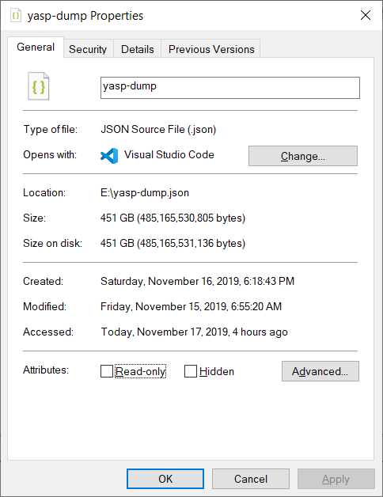

**Figure 1: The YASP file was 451 GB unzipped.**

Another issue was that the format of each individual game was different from the standard format provided by OpenDota, so we would need to rewrite our Python script to fit the new data. We would have been able to overcome these issues with the dataset were it not for the last issue we encountered: the datafile ended up still having unparsed games anyways. After all the effort we went through to wrangle this ‘perfect’ dataset, it would not work anyways. Due to these issues, we were forced to create our own dataset and abandon this datafile.

**2.3 Solutions**

After more research we found a package named ‘opendotaR’ that seemed to be able to pull only parsed games, which resolved our initial issue with the OpenDota API. We were now able to pull games with parsed chat at a rate around 1 game per 3 or 4 seconds. However, because our script and preferred machine learning library were in python, we still needed to make sure we could move and open the data without memory issues. 

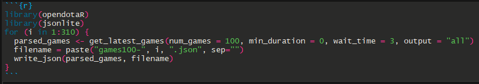

**Figure 2: opendotaR and jsonlite combine to create our json files, but wait 3 seconds between each API call. **

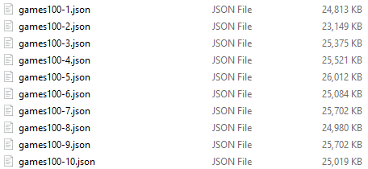

**Figure 3: The first 10 JSONS stored in our repository**

We were able to solve this by pulling batches of around 100 matches and using ‘jsonlite’ to store them. Our script would then iteratively read through all of the JSON files so opening the files would not fill our RAM immediately. We then proceeded to download 31,000 matches over the course of around 3-4 days, seperated into 310 different JSON files, finally resolving our torturous data collection process. 

**3.  Pre-Processing**

**3.1 Justification**

A large part of a project based in text analytics usually comes in the form of pre-processing data and finding intents of the words being looked at. At the beginning of the semester, we were recommended a large textbook with information on how to pre-process text data, and were advised that pre-processing would likely be the most lengthy and difficult process in our project. In light of this, it might be surprising to hear that our group ended up doing very little preprocessing on our data. Namely, we did not remove any variation on a word, meaning that our dataframe contained every version of a word ever used in any game in our dataset (i.e "what", “What”, and “what?” were different words). 

We feel that the justification for this is somewhat unique to the context of our project; DotA 2 is a very time dependent game where every second counts, and time spent typing is time that could be used to further your team’s probability of a victory. Therefore, the usage of stop words is a big indicator of emotions as most chat is extremely terse with the bare minimum of grammatical constructs (think ‘leet speak’). In a similar vein, casing, punctuation, and typos are also clear indicators of stress/emotion. In essence, the intentions behind each form of a word is different. Therefore, we elected to keep all variations of each word, including typos, stop words, and punctuation. 

While originally we had planned to only use words from the English language, DotA 2 has a large multinational player base with high concentrations of players from South America, Eastern Europe and Asia. We found that many games included more than one language, likely as a result of the high frequency of cross-server play among different regions. In light of this, we felt it would not be beneficial or even accurate to remove non-ASCII characters - we are looking at words as features, and if there is a particular non-english word that is highly correlated with a win or loss the language will not matter. Due to this we kept non-ASCII characters and by extension allowed different languages to be processed in the models. In the end, we used space as our only delimiter, creating a much larger data frame that we felt enabled out model to more accurately and fairly predict wins.

**3.2 Dataframe Creation**

At this point we had 310 jsons of 100 matches to create a dataframe from, and we knew that we wanted to split each game into 2 rows to represent the winning and losing teams in each game. Each json had a lot of extra information though, since the API returned all information from the game, ranging from tower kills to cosmetics used. After popping the excess information, we were left with a chat object that still had pings and spectator commentary. Using a separate json to associate pings with the text they displayed, we manually reformatted each ping object into a normal chat object. 

From here, we separated each individual chat message object by the player slot that said it (1-4 was one team, 4-9 was the other, 10 was spectator), removed the spectator objects, and assigned the rest to a win or lose list depending on which team won the game. For example, if Radiant (the bottom left team) won, then messages from slots 1-4 were assigned to the winning list and 4-9 the losing list; if Dire (top right) won, the opposite. 

As we assigned these chat message objects, we also scanned the actual text inside them, creating a separate word dictionary that would come to include every ‘word’ ever typed in any game in the entire dataset, by either team, not including spectators. Word is in quotes here since we used space as our only delimiter, and so some words in our dictionary were nonsensical. 

These words would go on to become the columns in our dataframe, and we used the previously created lists of winning and losing chats to populate the rows. Before inserting them into the dataframe, we added a value of 1 or 0 to the front, meant to signify if the row was from a winning or losing team. 

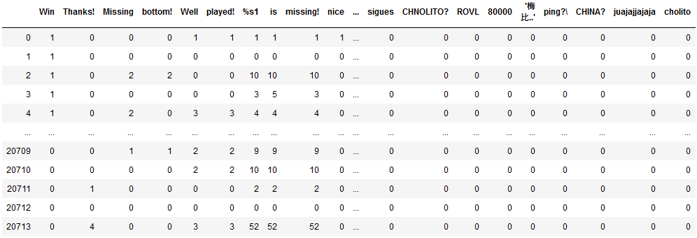

**Figure 4: A subset of our final dataframe before we ran models. The full dataframe would have around 62,000 rows.**

When running our models, we used 80% of this dataframe as the training data and 20% as the test data.

**4. Models, Results and Analysis**

**4.1  Naïve Bayes**

The first model we chose to run is Naïve Bayes, following the standard of using this as a baseline for the rest of our models. Naïve Bayes models run on the assumption that the predictors are conditionally independent from one another, however we know this is not the case for our model. For example, it is very likely for the word "well" to be followed by “played” in chat culture of DotA 2. We also know that we’ve separated several multi-word pings as well, so there was a high chance that some of our most common words would not be independent. Knowing that our data does not meet the assumptions for  Naïve Bayes, we did not expect to have good prediction accuracy with this model. 

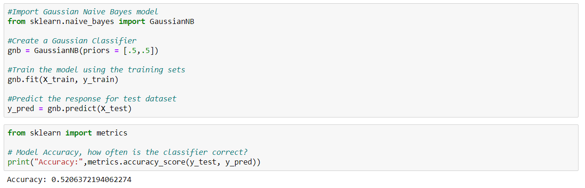

**Figure 5: Our prediction accuracy after training a Naïve Bayes model.**

As you can our results from Naïve Bayes were not great, but as expected. We were encouraged that our prediction accuracy at least did better than randomly choosing a win or loss, even if only marginal. With our baseline set, we were ready to move on to other models. 

**4.2  Knn**

The next model we chose to implement was K-nearest neighbors. We had higher expectations of this model because there are no assumptions made about the underlying data distribution or conditional dependency. To begin, we ran cross-validation to choose an appropriate k-value, which turned out to be 6 here.

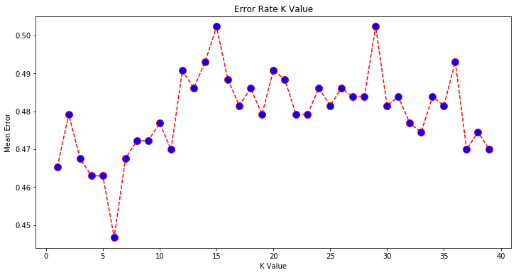

**Figure 6: Cross validation on our KNN model tells us that our best k-value is 6.**

However, KNN is not without its downsides. As the number of games got very large, the model began to take a very long time to make its predictions. This is because KNN calculates the closest K-nearest neighbors everytime it makes a prediction, rather than having a training phase. So when we have a large set of games, we must check all of them to see which games are closest to the game we want to predict. 

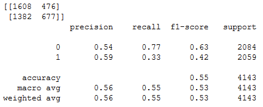.	

**Figure 7: The results our KNN model using k = 6.**

After running Knn our model was able to predict 55 percent of game results correctly. We were happy with this result as it did better than our Naïve Bayes standard. Looking at the confusion matrix and predictions, we see that our knn model favored predicting a win rather than a loss. So in general most chats were closer to those that won. 

**4.3 Decision Tree**

The model type that we expected to perform the best was the Decision Tree model. This is because the meaning of a word is dependent on the words around it. For example, the meaning of the phrase "we had a good game" has a positive connotation while “we did not have a good game” has a negative connotation. We see that these phrases use a lot of the same words, but have opposite meanings conditional on the presence of the word “not”. The structure of a decision tree allows for the meaning of one feature to be conditional on another, therefore we are able to retain this important information in our model.

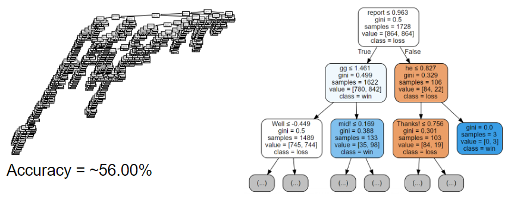

**Figure 8: The Decision Tree’s visual representations**

As our results show, our decision tree was able to predict the outcome correctly 56% of the time. This was the best accuracy we had obtained so far. When we look at the top of our decision tree we see some familiar words that we predicted would play a decent part. "gg" which stands for good game is typically said when you win or at least enjoyed playing the game. “report” is often said when a teammate is not playing well, when someone is toxic or the other team is doing so well that they think they are cheating. So generally when some says “report” they are in some capacity not satisfied with what is happening in the game. With these insights in mind our decision tree is actually highly interpretable. We see that if “report” is said even just once, the team who said it is more likely to lose, however if it is not said, and “gg" is said 2 times or more, it is more likely that the team won the game. This interpretability is a strong point of using a decision tree model. 

 

**4.4 Random Forest**

After we saw how well our decision tree model was doing, we decided to make a Random Forest Model. Random Forests addresses a few of the problems that arises from Decision Trees. Random Forests are able to reduce variance by taking the average of multiple trees. Decision Trees are also prone to overfitting, especially with a deep tree. However, there is a tradeoff of better accuracy for more complexity and less interpretability. Using cross validation we obtained 91 trees for our Random Forest. Our Random Forest model gave us an accuracy of 61.48%, which was the best accuracy out of all our models.

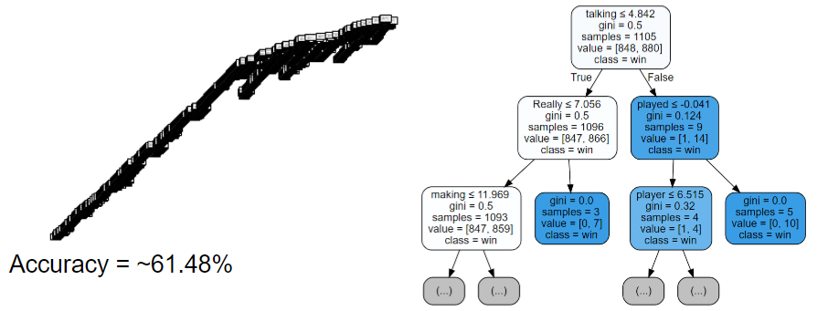

**Figure 9: The visual representations of a random tree from the Random Forest. There were 90 other trees like this one, with slight variations.****
**

**4.5 PCA**

PCA was not one of the models that we initially ran, and was only added on after our presentation as something we wanted to try. Due to there being many correlated words, we thought PCA might help reduce our features by a sizeable amount. However, after running the model, we found that our predictors did not compress as well as we had hoped, and we ended up with around 350 components. The best of these components were not able to explain more than 0.02% of the total variance and the majority of them explained effectively 0% of it.

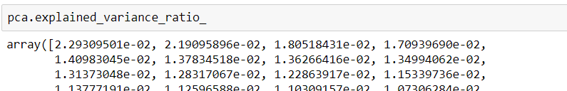

**Figure 10: The explained variance of the first several components of our PCA model**

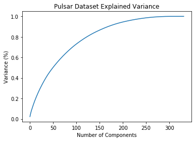

**Figure 11: A plot of the explained variance of all 300 of our components**

While we would have liked to be able to run our models with the principal components, we deemed it not worth our time in the last two weeks of the semester and instead focused our time on cloud computing, an endeavor we found much more promising and which had a much higher potential.

**5. Cloud Computing
**

Over the course of our entire project, there was always one major limitation in running our models, and that was our hardware limiting the size of the models that we could fit and train. We were never able to run our models on our full dataset as it was too big. The best solution to this problem was to use hardware that could handle it, and that involves cloud computing. We applied to use the UNC Longleaf Computing Cluster, and uploaded our data into the PINE server (UNCs’ scratch and work file storage) using GLOBUS (A large-file transfer application) and got ready to submit our job into the SLURM scheduler but it would not get to run our code in time as the computing clusters are in high demand by all the researchers at UNC. Instead we decided to use Amazon Web Services to host and process our data. At first we had hoped to use Sagemaker since it includes preset templates for machine learning processes, but in the end we decided to use Amazon EC2 (Elastic Compute Cloud) to host a memory-optimized VM that could run our code for us.

We uploaded our data to Amazon S3 (Simple Storage Solutions), then created a new EC2 instance of type r4.8xlarge, which is a large memory-optimized cluster having 244 gigabytes of memory which solved our previous problems. We then transferred our data to Amazon EBS (Elastic Block Store) which provides block level storage volumes for EC2 usage. From this we could quickly transfer data to and from our S3 storage to EBS storage whenever we wanted too. After copying our data in our EBS volume, we could access it in our EC2 instance. After this we installed Anaconda and other necessary packages to run our Python script, and uploaded our Jupyter Notebook. Running the notebook, it was immediately clear that it was much faster compared to our machines as portions of the script that previously took hours to run now took minutes. The code was running, until what we can assume to be a small service interruption happened since the server stopped and started just giving a generic network error. Due to this error wasting a large amount of our time since our dataset was more than triple the size of what we ran before, we knew that we did not have enough time until the submission date of the project. Even though we were not able to finish this in time, if given a few extra days we know that we could have gotten amazing results, possibly beating our previous accuracy of 61.48% due to a much larger set of data to train on.

The process of being able to rent out a computing cluster in a matter of minutes and getting started on running code on it has verified the hype behind cluster computing for anyone with a modicum of programming knowledge. Our use of cloud computing confirms that the emergence of this process is not a company buzzword, but a legitimately useful and cost-effective piece of technology. Given some extra time, we feel like we could have gotten our models to run on Amazons’ EC2 cluster as the initial setup was not very difficult, the only difficult part was waiting hours for the model to finish training and testing.**
**

**
**

**6. Conclusions and Improvements
**

**6.1 Conclusions**

As mentioned earlier, our Random Forest model had the best prediction accuracy of  61.48%. Going into this project we were not even certain that the chat would give us insight on the outcome, so we were surprised to be able to predict wins with considerably higher accuracy than randomly guessing. Furthermore, we do not think our prediction rate can get *much *better because, while chat *can* give us insights about the outcome of the game, it certainly will not always and a lot of times our best statistical prediction will still be wrong. For example "gg" and “report” are still often said regardless of whether a team won or lost. In addition, match-making for DotA is done by both MMR and behavior, creating a normalizing factor that our model has to overcome. 

**6.2 Improvements**

While we were overall satisfied with our results and the end state of our project, there are definitely a few things we would’ve liked to have done differently, and some limitations that our project would have benefitted from not having. 

1. As is evidenced by the length of the sections in this report, our project experienced a lot of issues with data collection. A significant portion of the semester was spent just trying to get data that we could use to train our model. While we did eventually resolve this issue, it definitely took longer than we would’ve liked and we feel that it left us with not enough time to try all of the models that we could’ve. While our results ended up satisfactory, we can’t help but wonder if we could have improved the context of them, or even had a higher prediction rate. 

2. At present, our model takes an input of one team’s chat and outputs a prediction of whether or not that team will win. This is not as useful due to the required preparation associated with obtaining the chat for just a single team. Given unlimited time, we think we could improve the usability of our model by allowing it to instead take in the entire game chat object and predict which team would win, as opposed to just taking in one team’s chat.

3. With how large our data frame is, and especially how sparse, we think it could really benefit from having a significantly larger set of matches to train on. Of course, this is a bit of a so-called ‘freebie’ when it comes to machine learning, but with the way we are conducting our data analysis, more data is critical. Our low pre-processing leaves a lot of unique words due to typos and normal variation. This is acceptable, and indeed, what we wanted; however, it suffers in a scenario where it does not have a large enough sample to identify the more unique words that influence a game’s outcome. For example, with a low number of games, the model will still pick out words such as "good" and “game” because they are in pretty much every game. However, it may be less successful at picking out other words that are still influential but less common. In essence, our model may strengthen more with additional data compared to the average model, and we think it could really shine if it was able to use a sample on the scale of millions of matches.

**References

**Jurafsky, Dan, and James H. Martin. Speech and Language Processing: an Introduction to
 Natural Language Processing, Computational Linguistics, and Speech Recognition. 3rd ed., 2019, web.stanford.edu/~jurafsky/slp3/edbook_oct162019.pdf.

Pedregosa, Fabian and Gaël Varoquaux, and Alexandre Gramfort and Vincent Michel and Bertrand Thirion and Olivier Grisel and Mathieu Blondel and Peter Prettenhofer and Ron Weiss. and Vincent Dubourg Jake and Vanderplas and Alexandre Passos and David Cournapeau and Matthieu Brucher and MatthieuPerrot and Édouard Duchesnay. "Scikit-learn: Machine Learning in Python.” *Journal of Machine Learning Research *12 (2011): 2825-2850. Print.

Navlani, Avinash. "KNN Classification Using Scikit-Learn." DataCamp Community, DataCamp Inc, 2 Aug. 2018, www.datacamp.com/community/tutorials/k-nearest-neighbor-classification-scikit-learn.

Navlani, Avinash. "Random Forests Classifiers in Python." DataCamp Community, DataCamp Inc, 16 May 2018, www.datacamp.com/community/tutorials/random-forests-classifier-python.

Navlani, Avinash. "Naive Bayes Classification Using Scikit-Learn." DataCamp Community, DataCamp Inc, 4 Dec. 2018, www.datacamp.com/community/tutorials/naive-bayes-scikit-learn.

Koehrsen, Will. "How to Visualize a Decision Tree from a Random Forest in Python Using Scikit-Learn." Medium, Towards Data Science, 19 Aug. 2018, towardsdatascience.com/how-to-visualize-a-decision-tree-from-a-random-forest-in-python-using-scikit-learn-38ad2d75f21c.

Gonsales, Arthur. "An Approach to Choosing the Number of Components in a Principal Component Analysis." Medium, Towards Data Science, 12 Sept. 2018, towardsdatascience.com/an-approach-to-choosing-the-number-of-components-in-a-principal-component-analysis-pca-3b9f3d6e73fe.